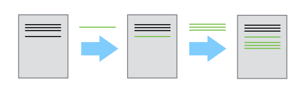

We'll start by exploring how version control can be used
to keep track of what one person did and when. Version control 
systems start with a base version of the document and
then record changes you make each step of the way. You can 
think of it as a recording of your progress: you can rewind to start at the base
document and play back each change you made, eventually arriving at your more recent version.

Here's one way to think about how version control works.

Imagine that you have a very large (more than 2,000 piece!) puzzle that you want 
to put together, but when you bought it, the box didn't have a picture.
So, you have a massive puzzle and no idea what it is supposed to look like when it's done. 
Excited, you clear off the dining room table and get to work. Since you know that this is 
going to take you weeks or months to finish, you decide to take polaroids to track your progress. 
Each day when you finish work, you take the polaroid photo, label it, and put it in a filebox.

One day, some poor unknowing soul decides to "help" you with the puzzle 
(maybe your cat or toddler). The next morning you walk in and the puzzle is a wreck!! 

What do you do?

Go back to the polaroids!!

This process of taking "snapshots" of your work and storing them **_is version control_**!!

To make this process work, is that each time you stop working on your personal puzzle,
you take a snapshot, label it, and put it in your filebox for later. 
Because you can't keep multiple puzzles in varying stages of completion in your closet, 
each photo contains the _differences_ between versions, they are not old versions themselves. 
This means that version control can take you from the original, to version 4, back to 2, etc.

A version control system is a tool that keeps track of changes for us 
(each snapshot of these changes is called a [commit]({{ page.root }}/reference#commit)), 
and keeps useful metadata about them. The complete history of commits for a 
particular project and their metadata make up the filebox, also called a 
[repository]({{ page.root }}/reference#repository). Repositories can be kept in sync
across different computers, facilitating collaboration among different people.

> ## The Long History of Version Control Systems
>
> Automated version control systems are nothing new.
> Tools like RCS, CVS, or Subversion have been around since the early 1980s and are used by many large companies.
> However, many of these are now considered legacy systems (i.e., outdated) due to various limitations in their capabilities.
> More modern systems, such as Git and [Mercurial](https://swcarpentry.github.io/hg-novice/),
> are *distributed*, meaning that they do not need a centralized server to host the repository.
> These modern systems also include powerful merging tools that make it possible for multiple authors to work on
> the same files concurrently.
{: .callout}

> ## Paper Writing
>
> *   Imagine you drafted an excellent paragraph for a paper you are writing, but later ruin it. How would you retrieve
>     the *excellent* version of your conclusion? Is it even possible?
>
> *   Imagine you have 5 co-authors. How would you manage the changes and comments they make to your paper?
>     If you use LibreOffice Writer or Microsoft Word, what happens if you accept changes made using the
>     `Track Changes` option? Do you have a history of those changes?
{: .challenge}
